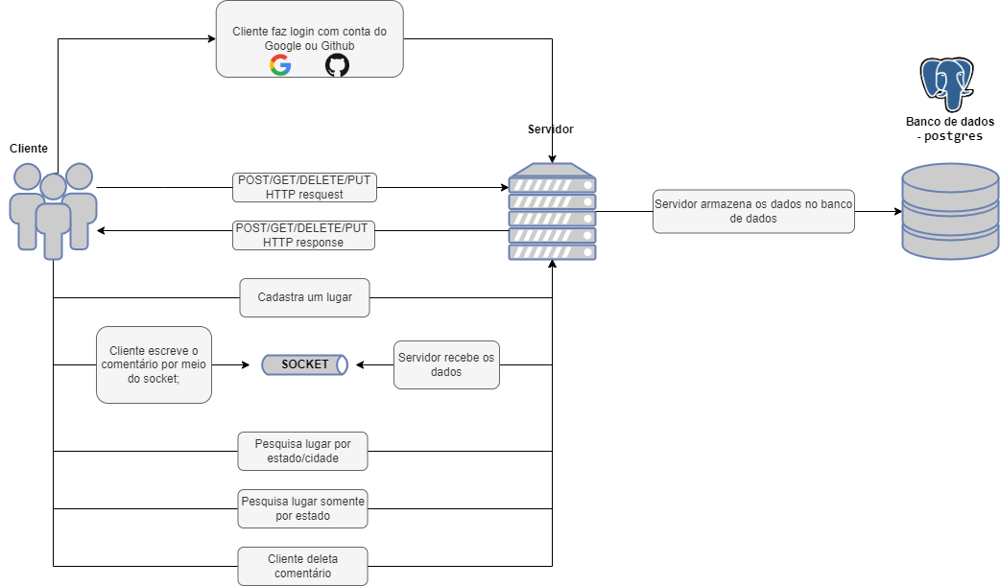
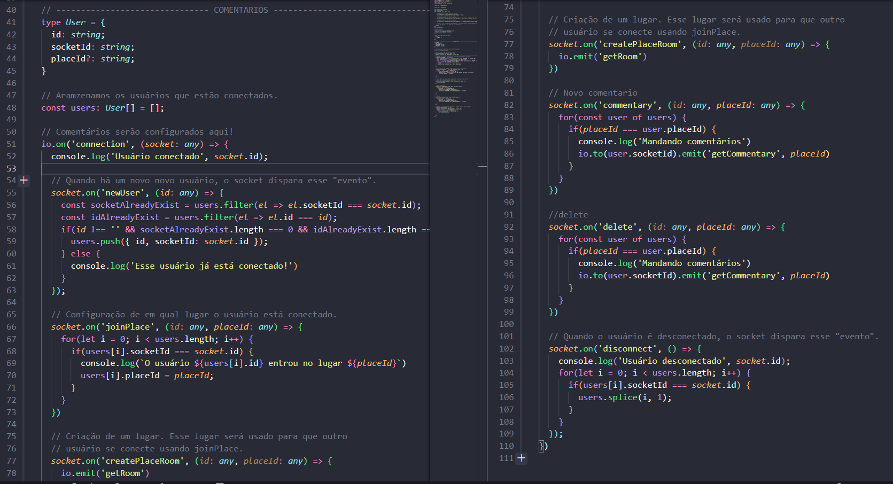
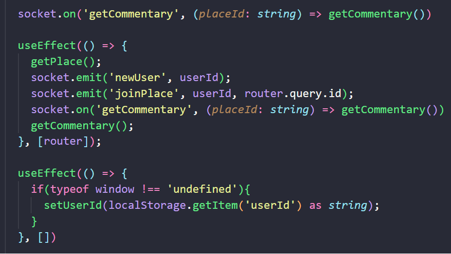

# Sistemas Distribuidos - Projeto Final

## Sistema
O sistema criado tem o mesmo intuitivo de uma rede social, porém focado para compartilhamento e busca de opniões e localizações para passeios. O usuário poderá selecionar a cidade de seu interesse e través de opniões de outros usuários poderá ver qual o melhor passeio para ele.

## Principais funcionalidades
- Buscar estado de interesse;
- Buscar cidade de interesse;
- Adicionar um ponto de interesse;
- Adicionar novas opiniões a respeito dos pontos selecionados;
- Mostrar comentários de outros usuários dentro dos pontos selecionados;

## Funcionalidades
1 - O cliente realiza o login <br /> 
2 - O cliente pode adiconar um ponto de interesse <br /> 
 <br />
1 - o cliente realiza o login <br /> 
2 - o cliente pode pesquisar por um ponto de interesse através de estado e cidade ou apenas o estado  <br /> 
3 - o cliente pode adicionar um novo comentario dentro do ponto de interesse <br /> 

## Stack
- NextJS (front-end)
- Node JS (back-end)
- PostgreSQL

## Dependências do Front-end
- Next/router
- Remix icon
- Tailwind CSS
- socket.io-client

## Dependências do Banck-end
- Cors
- Docker
- Sequelize
- UUIDV4
- Express
- socket.io

## :warning: IMPORTANTE
### Back-end
No arquivo ***src/shared/infra/sequelize/config.json*** é necessário adequar os dados no banco de dados do seu computador.

```json
{
    "dialect": "postgres",
    "host": "localhost",
    "username": "postgres",
    "password": "1234567",
    "database": "postgres" ,
    "define": {
        "timestamps": true,
        "underscored": true
    }
}
```

## Executando a aplicação

### Banco de dados
Caso você utilize Docker, execute: 
```
docker run --name turistando -d -p 5432:5432 -e POSTGRES_PASSWORD=1234567 postgres
```
> Esse comando criará um banco de dados MySQL no Docker usando a porta 5432 de nome turistando, na qual a senha é 1234567.
Caso você utilize algum software de banco de dados (DBeaver, MySQL, Workbench, BeeKeeper, etc), crie a sua conexão  
  
Depois de criar o seu banco de dados e estabelecer sua conexão, execute os comandos dentro da pasta Backend:
```
yarn 
```
```
yarn sequelize db:migrate
```
> O yarn instalará todas as dependências do projeto backend e o comando sobre sequelize executará as migrations no seu bando de dados.

### Back-end
Depois de feito os comandos relacionados ao banco de dados e, caso necessário, alterar o arquivo de configuração do sequelize, execute:
```
yarn dev:server 
```
> Caso queira realizar testes de API, utilize softwares como Insomnia ou Postman


## Front-end
Na pasta frontend instale as dependências com o comando:
```
yarn 
```
Rode o frontend executando:
```
yarn dev
```


## Arquitetura e funcionamento do sistema


## Interface de serviço


### Servidor


### Cliente
### Contato
| Nome                          | Contato                                |
| ----------------------------- |:--------------------------------------:|
| Gabriela Marangoni Radigonda  | gabrielaradigonda@alunos.utfpr.edu.br  |
| Juliano Kendyi Shinohara      | julianoshinohara@alunos.utfpr.edu.br   |
